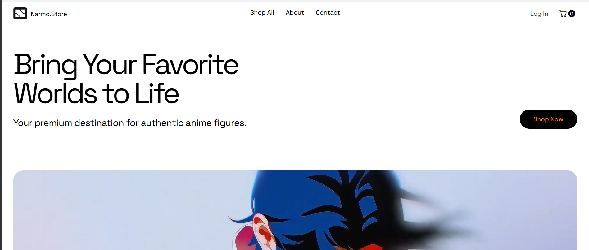
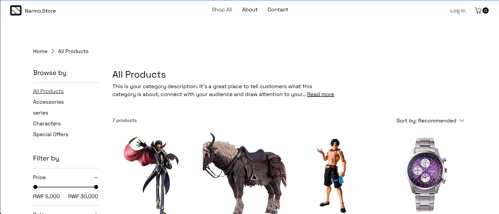
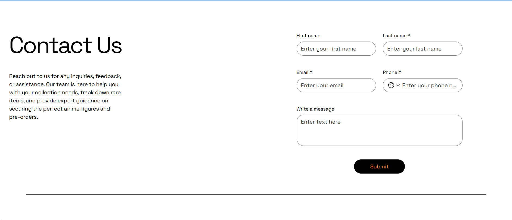
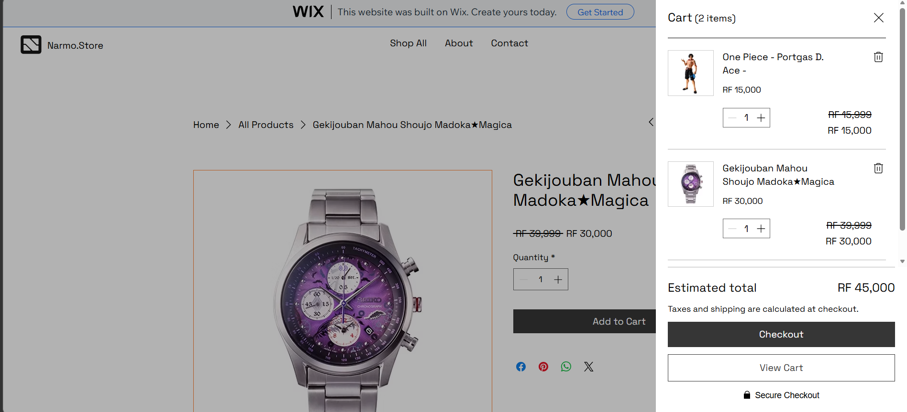
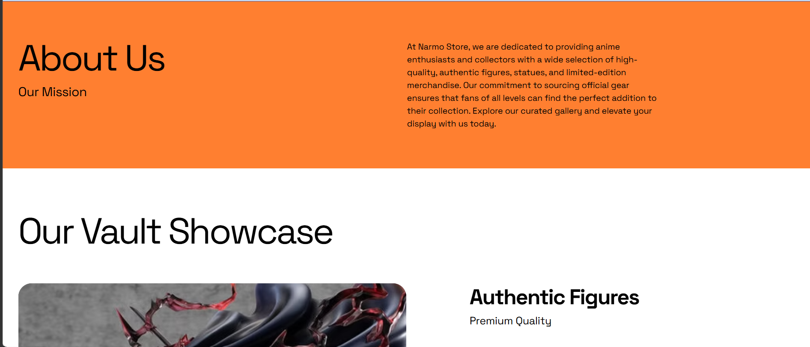

# Narmo - Anime E-Commerce Application

## Student Information
* **Name:** Omran Nasir Abdelmoniem Mohamed
* **Institution:** UNILAK
* **Course:** E-Commerce And Web Application Course | EWA408510
* **Academic Year:** 2025-2026 | Semester: II

## Project Overview
**Project Title:** Group Assignment I - No-Code E-Commerce Application Design Project
**Store Name:** Narmo
**Platform Used:** Wix
**Live Website Link:** https://hareedi17.wixsite.com/narmo
**GitHub Repository Link:** [Insert Your GitHub Repo Link Here]

## Features Implemented
* **Homepage:** Features the "Narmo" store name, a welcoming anime-themed hero section, and a clear call to action to shop our collections.
* **Product Page:** Displays a minimum of 5 distinct anime products complete with images, pricing, and descriptions.
* **About Page:** Details our mission to provide the community with high-quality, authentic anime merchandise and apparel.
* **Contact Page:** Includes a functional contact form, alongside placeholder email and phone details for customer support.
* **Cart Interaction:** Fully functional add-to-cart simulation allowing users to select their favorite merchandise and view it in their cart.

## Screenshots
*(All screenshots are stored in the `images/` directory within this repository)*

### 1. Homepage

### 2. Product Page

### 3. Contact Page

### 3. Cart Page

### 3. About Us Page

## Challenges
* **Template Customization:** Adapting a photography-based Wix template to fit a vibrant anime/streetwear aesthetic required careful replacement of visual assets and color palette adjustments.
* **Cart Configuration:** Implementing and testing the cart simulation within Wix's free tier limits to ensure a seamless "Add to Cart" user experience without triggering actual payment gateways.

## Lessons Learned
* **Rapid Prototyping:** Mastered the ability to rapidly design and deploy a functional e-commerce storefront using a no-code platform (Wix).
* **Technical Documentation:** Learned how to structure technical documentation using GitHub Markdown, specifically organizing directories for visual assets and formatting clear, readable project reports.
